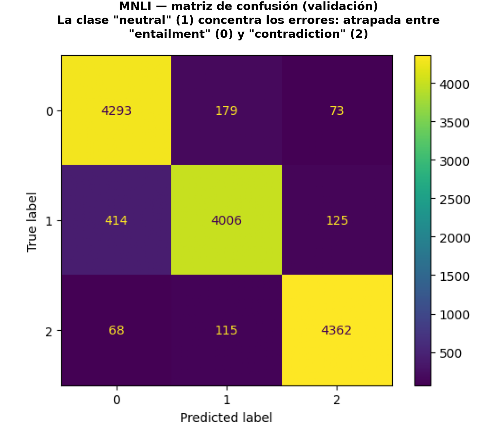
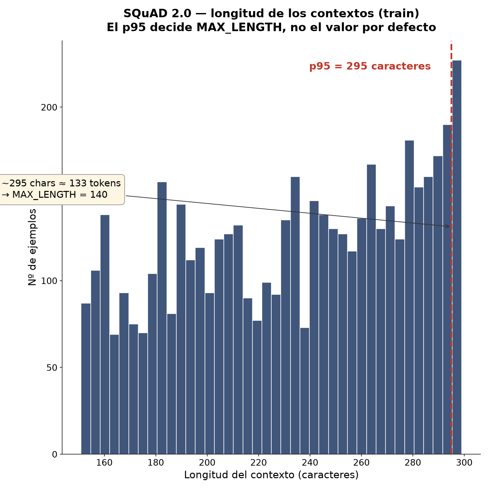

# Dos cuadernos de fine-tuning con Hugging Face

Clasificación de inferencia textual y *question answering* extractivo, con modelos tipo
BERT/RoBERTa sobre PyTorch. Módulo de *Introducción al Procesamiento de Lenguaje Natural*
del Máster en Big Data, Data Science e IA de la Universidad Complutense (curso 2025-26).

Son las dos tareas evaluables de la asignatura, con las celdas de enunciado y de
corrección del profesor tal cual se entregaron. Los dos *checkpoints* de partida **ya
venían entrenados en la tarea que se evalúa** —`nli-distilroberta-base` sobre NLI,
`roberta-base-squad2` sobre SQuAD—, así que las métricas miden sobre todo lo que el
modelo ya sabía. Lo mío aquí es el análisis de longitudes, el preprocesado y el mapeo de
*offsets*.

Los dos requieren GPU y están preparados para Google Colab.

---

### [`01_clasificacion_mnli.ipynb`](01_clasificacion_mnli.ipynb) — inferencia textual (MNLI)

MNLI da pares premisa–hipótesis y hay que decir qué relación tienen: *entailment* (la
hipótesis se deduce), *neutral* (compatible, pero no se deduce) o *contradiction*.
*Fine-tuning* de `cross-encoder/nli-distilroberta-base` sobre el corpus filtrado a premisas
cortas, con la tokenización de pares de secuencias que el modelo necesita para saber dónde
acaba una y empieza la otra.



Los errores no se reparten. *Neutral* se lleva la mayoría, y tiene su lógica: está
justo en medio de las otras dos, y el límite entre "no se deduce" y "se contradice" es
resbaladizo incluso para una persona.

---

### [`02_question_answering_squad2.ipynb`](02_question_answering_squad2.ipynb) — QA extractivo (SQuAD 1.1)

Dada una pregunta y un contexto, señalar el fragmento exacto que la responde. Se parte de
`deepset/roberta-base-squad2` y se ajusta sobre **SQuAD 1.1** (`load_dataset("squad")`),
filtrado por el enunciado a contextos de menos de 300 caracteres: 3.466 ejemplos de
entrenamiento y 345 de validación. El nombre del cuaderno viene del *checkpoint*, no del
dataset: aquí no hay preguntas sin respuesta.

Antes de tocar el modelo, un vistazo a las longitudes:



El percentil 95 del contexto queda por debajo de 295 caracteres y el de la pregunta por
debajo de 100. Con eso, `MAX_LENGTH = 140` tokens cubre casi todo el corpus. Es un
parámetro que se suele dejar en el valor por defecto y tiene coste por los dos lados:
truncar de más pierde la respuesta, truncar de menos quema GPU en relleno.

El resto del cuaderno es la fontanería del QA extractivo: mapear las posiciones de la
respuesta de caracteres a *tokens* con `offset_mapping` y reconstruir el fragmento
predicho a partir de los índices.

La evaluación es la que fija el enunciado: solapamiento de palabras entre la respuesta
predicha y la real, sobre veinte ejemplos de validación elegidos por el profesor. **No es
Exact Match ni F1 de SQuAD**, y no da para comparar *checkpoints*. Montar la evaluación
oficial con `evaluate` está pendiente.

---

En local, sin Colab:

```bash
pip install transformers datasets evaluate torch accelerate
jupyter lab
```

Los *checkpoints* entrenados pesan varios GB y no se versionan; los cuadernos los
regeneran desde cero.
